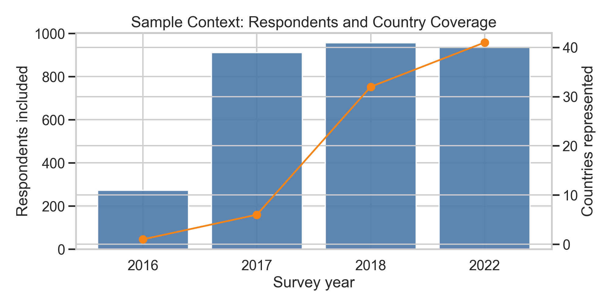
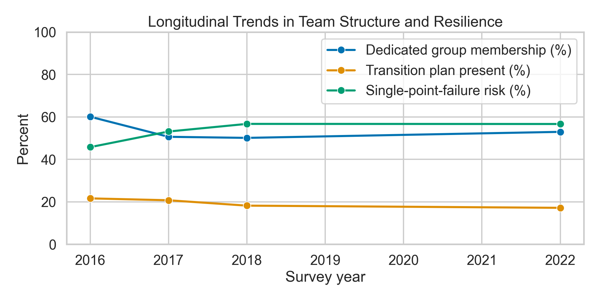
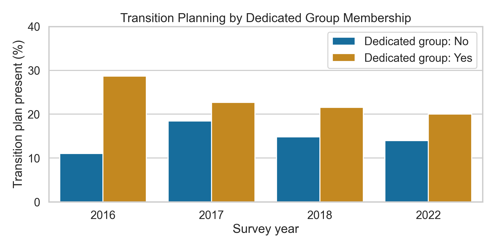
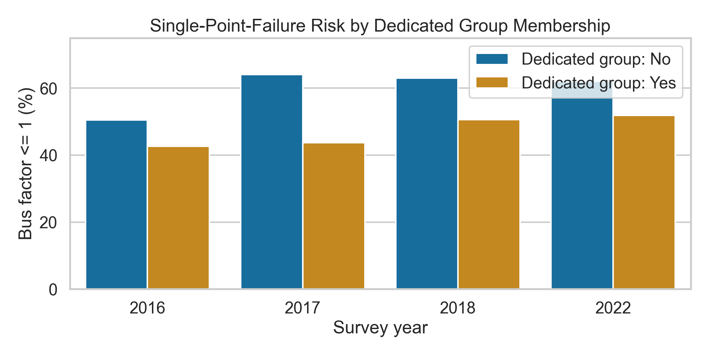
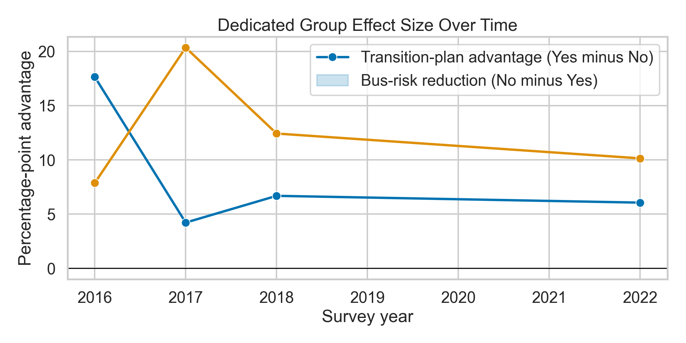

# Do Dedicated Software Groups Improve Research Software Resilience?

## Central Question

Across all available survey years (2016, 2017, 2018, 2022), do RSEs in dedicated software groups report stronger resilience practices than RSEs who are not in dedicated groups?

The central claim is:
dedicated software groups are consistently associated with better resilience outcomes.

## Why This Is Key

This question matters because resilience is the practical bottleneck for research software.

- If projects have no transition plan when developers leave, teams lose continuity.
- If bus factor is very low, critical software depends on too few people.
- Unlike individual job satisfaction, team structure is an institutional lever: leaders can create dedicated groups.

So this is not just descriptive; it is directly policy-relevant.

## What "Resilience" Means Here

In this analysis, **resilience** means the ability of research software work to continue effectively when people change.

Operationally, it is measured using:

- **Transition-plan coverage** (`stability2_0`): whether teams report having a plan when developers leave.
- **Bus-factor risk** (`stability1_0`): the share of responses with bus factor `<= 1` (higher share means lower resilience).

## Key Information and Data Supporting the Claim

### Data used

- Four survey waves: `2016_tf.csv`, `2017_tf.csv`, `2018_tf.csv`, `2022_tf.csv`.
- Longitudinal variables used in all waves:
- `currentWork2_0` (dedicated group membership)
- `stability2_0` (transition plan present)
- `stability1_0` (bus factor)
- 2017+ filtered to respondents where `rse1_0 == True`.
- 2016 has no `rse1_0` in this table, so all 2016 rows are retained.

Primary generated tables:
- `outputs/yearly_summary.csv`
- `outputs/group_summary.csv`
- `outputs/effect_summary.csv`

### Exact survey questions behind the metrics

The variable names are harmonized (`currentWork2_0`, `stability1_0`, `stability2_0`), but wording shifted slightly by year:

| Metric used in this analysis | 2016 wording | 2017 wording | 2018 and 2022 wording |
| --- | --- | --- | --- |
| Dedicated group membership (`currentWork2_0`) | "Do you work within a group that provides software development help or expertise to researchers from other groups within your organisation?" | "Do you work for a Research Software Group?" | "Are you part of a dedicated research software group within your institution?" |
| Bus factor (`stability1_0`) | "What is the bus factor of your most important software project?" | "What is the bus factor of your most important software project?" | "What is the bus factor of your most important software project? (The bus factor designates the minimal number of developers that have to be hit by a bus (or quit) before a project is incapacitated)" |
| Transition-plan coverage (`stability2_0`) | "Is there a technical hand-over plan for your most important software project?" | "Is there a technical hand-over plan for your most important software project?" | "Do the projects you work on typically have a plan to cope with developers leaving the group?" |

Interpretation note:
- `stability2_0` moves from "most important project" (2016/2017) to "projects you work on typically" (2018/2022), so longitudinal comparisons should be interpreted as directional rather than exact like-for-like prevalence.

### Evidence 1: Transition planning is consistently better in dedicated groups

| Year | Dedicated group: Yes | Dedicated group: No | Advantage (Yes minus No) |
| --- | --- | --- | --- |
| 2016 | 28.66% | 11.01% | +17.65 pp |
| 2017 | 22.66% | 18.45% | +4.21 pp |
| 2018 | 21.53% | 14.85% | +6.68 pp |
| 2022 | 20.00% | 13.95% | +6.05 pp |

Average transition-plan advantage across years: **+8.65 percentage points**.

Source table: `outputs/group_summary.csv` and `outputs/effect_summary.csv`.

### Evidence 2: Single-point-failure risk is lower in dedicated groups

Metric: percent with bus factor `<= 1` (higher means worse resilience).

| Year | Dedicated group: No | Dedicated group: Yes | Risk reduction (No minus Yes) |
| --- | --- | --- | --- |
| 2016 | 50.46% | 42.59% | +7.87 pp |
| 2017 | 64.03% | 43.68% | +20.35 pp |
| 2018 | 63.01% | 50.58% | +12.43 pp |
| 2022 | 62.03% | 51.90% | +10.14 pp |

Average bus-risk reduction across years: **12.70 percentage points**.

Source table: `outputs/group_summary.csv` and `outputs/effect_summary.csv`.

### Evidence 3: The pattern persists despite changing survey coverage

- Country coverage expands from 1 country (2016) to 41 countries (2022).
- Even with changing composition, the direction of the dedicated-group effect stays consistent in every wave.

Source table: `outputs/yearly_summary.csv`.

## Figures

### Figure 1: Sample context (respondents and country coverage)

### Figure 2: Longitudinal trends in structure and resilience

### Figure 3: Transition planning by dedicated group status

### Figure 4: Single-point-failure risk by dedicated group status

### Figure 5: Dedicated-group effect sizes over time

## Novelty Check (as of February 16, 2026)

I checked both local and online sources for this exact insight: a **cross-year, quantified association** between dedicated-group membership and resilience outcomes (transition planning plus bus-risk reduction).

What I checked:

1. The local longitudinal repository (`RSE_survey_longitudinal`) and generated metadata files (`*_cols.csv`, `*_tf.csv`) for an existing precomputed relationship analysis.
2. 2022 report page with separate sections for dedicated group, bus factor, and transition plan: https://rse-survey-2022.github.io/ukrse/rse-survey-2022.html
3. Software Sustainability Institute blog summary of international results: https://www.software.ac.uk/blog/results-international-survey-research-software-engineers-rse
4. URSSI summary post for 2017 international survey: https://www.urssi.us/blog/2018/11/14/results-of-the-2017-international-survey-of-research-software-engineers-rses

Assessment:

- I found public reporting of these variables mostly as **separate descriptive results**.
- I did **not** find the same multi-year linked effect-size framing used here (`+8.65 pp` transition-plan advantage and `12.70 pp` bus-risk reduction).
- So this analysis appears **novel relative to the public outputs I could verify**.

Important caveat:
- I cannot prove absolute global novelty ("never done anywhere") without a formal systematic literature search across indexed databases and unpublished/internal analyses.

## Final Recommendation

Institutions that want more sustainable research software should treat dedicated software groups as core infrastructure, not an optional staffing model.

Recommended action:

1. Create or expand dedicated RSE groups where they do not exist.
2. Require transition planning as a standard group practice.
3. Track two resilience KPIs yearly: transition-plan coverage and bus-factor `<=1` risk.
4. Evaluate impact by comparing dedicated-group and non-dedicated-group outcomes over time.

Dedicated groups are not a complete solution, but this multi-year evidence shows they are a consistent and actionable structural advantage.
